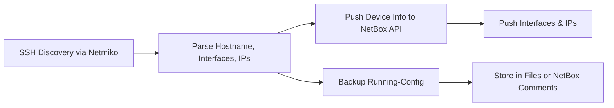

# NetBox-AutoPush

> 🧠 A real-world, enterprise-grade **Network Automation Project** using **NetBox** + **Python** to automate device discovery, config backup, and dynamic NetBox updates.

---

## 🚀 Why We Built This Project

In large-scale networks, managing routers, switches, and IPs manually is slow, error-prone, and hard to track. Most enterprises now use:

- ✅ **Source of Truth platforms** to store live device data
- ✅ **Automation tools** to reduce human errors
- ✅ **APIs** to sync real-time changes

We built this project to **simulate what top companies like Meta, AWS, and Cisco do**: manage networks using NetBox and automate discovery/configuration with Python.

---

## 📌 Why NetBox?

NetBox is an open-source infrastructure resource modeling (IRM) tool used for:

- 📡 IP Address Management (IPAM)
- 🖧 Device and Interface Inventory
- 🌐 Site and Rack Organization
- 📊 Real-time Documentation
- 🤖 Automation-ready via REST API

In short, **NetBox is our Source of Truth**, and we push network data into it so everything stays updated, searchable, and centralized.

---

## 🛠 What We Did in NetBox

We manually or automatically created and managed the following inside NetBox:

| 🔧 Module          | 💡 Purpose / Actions Taken                                                                 |
|--------------------|---------------------------------------------------------------------------------------------|
| **Sites**          | Created physical locations like `Main-DC`, `Branch1`                                        |
| **Devices**        | Automatically pushed from Python (hostname, type, platform, mgmt IP)                        |
| **Device Roles**   | Defined roles like `Router`, `Switch`, `Firewall`                                           |
| **Manufacturers**  | Added Cisco, Juniper, etc.                                                                   |
| **Platforms**      | Added `Cisco IOS`, `NX-OS`, etc.                                                             |
| **Interfaces**     | Pulled from live devices via Netmiko and synced to NetBox                                   |
| **IP Addresses**   | Mapped interface IPs from routers and switches into NetBox                                  |
| **Config Backups** | Saved running-config into files or comments field (optional)                                |
| **Tags/Custom Fields** | Used to track device owners, environment (lab, prod), and other custom info            |

---

## 🔂 Project Workflow



---

## 📁 Folder Structure

```bash
NetBox-AutoPush/
├── README.md
├── requirements.txt
├── .gitignore
│
├── docker/
│   ├── netbox-postgres-data.tar.gz
│   ├── netbox-redis-data.tar.gz
│   ├── netbox-redis-cache-data.tar.gz
│   ├── netbox-reports-files.tar.gz
│   └── netbox-media-files.tar.gz
│
├── gns3/
│   └── Netboxproject.gns3
│
├── data/
│   └── netbox_devices.csv
│
├── scripts/
│   └── discovery_and_push.py
│
└── docs/
    ├── Notes.txt
    ├── R1 _ NetBox.html
    ├── Rack Elevations _ NetBox.html
    └── logo_netbox_bright_teal.svg


---

## ⚙️ How to Run the Project

### 1. Clone the Repo

```bash
git clone https://github.com/your-username/NetBox-AutoPush.git
cd NetBox-AutoPush
```

### 2. Install Requirements

```bash
python3 -m venv venv
source venv/bin/activate
pip install -r requirements.txt
```

### 3. Set Up

- Add your NetBox token and API URL in `.env`
- Add router/switch SSH info in `credentials.yaml`

### 4. Run the Scripts

```bash
# Discover devices
python3 Project-1_Device_Discovery_Push/discover_devices.py

# Push to NetBox
python3 Project-1_Device_Discovery_Push/netbox_api_push.py

# Backup configs
python3 Project-1_Device_Discovery_Push/config_backup.py
```

---

## 🔮 Future Goals

- [ ] Add config compliance check (audit for unauthorized changes)
- [ ] Pull existing NetBox inventory and compare with live state
- [ ] Integrate with Grafana for visualization
- [ ] Add Jenkins pipeline for automated runs
- [ ] Extend to Meraki, Aruba, Fortinet using APIs

---

## 🙌 Acknowledgments

- Built with inspiration from enterprise NOCs and GitHub community
- Uses [NetBox](https://github.com/netbox-community/netbox) and [Netmiko](https://github.com/ktbyers/netmiko)

---

## 📄 License

MIT License — free to use and improve.
